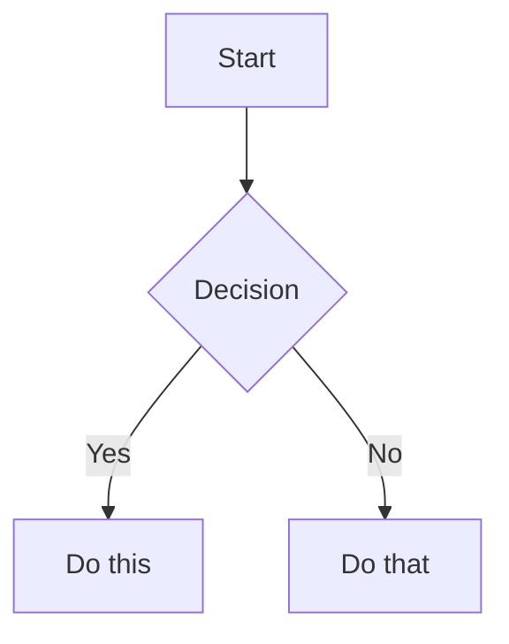
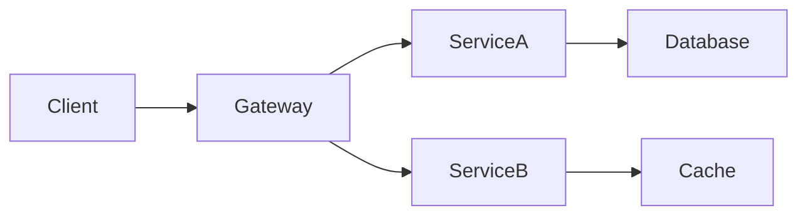

# Rhesis Markdown Format Guide

This guide describes the markdown format used by Rhesis to generate HTML presentations with optional audio narration and video recording capabilities.

## Table of Contents

1. [Markdown Format Specification](#markdown-format-specification)
2. [Using the Rhesis Executable](#using-the-rhesis-executable)
3. [Examples](#examples)
4. [Tips for AI-Generated Presentations](#tips-for-ai-generated-presentations)

## Markdown Format Specification

### Document Structure

A Rhesis presentation follows this hierarchical structure:

```
# Presentation Title (Required)
[Global Metadata]
## Slide 1
[Slide Metadata]
[Slide Content]
---
[Transcription/Narration]
## Slide 2
...
```

### 1. Presentation Title

- **Required**: Must be the first line of the document
- **Syntax**: Single H1 heading using `# Title`
- **Example**: `# Introduction to Machine Learning`

### 2. Global Metadata (Optional)

Place these options after the title, before any slides:

- `Duration: N` - Total presentation duration in seconds
- `Default time: N` - Default slide duration in seconds (defaults to 10 if not specified)

Example:
```markdown
# My Presentation
Duration: 300              # 5 minutes total
Default time: 15           # Each slide defaults to 15 seconds
```

### 3. Slides

Each slide begins with an H2 heading (`## Slide Title`).

#### Slide Structure:
1. **Title**: H2 heading marks the beginning of a new slide
2. **Metadata** (optional): Slide-specific options
3. **Content**: Markdown content displayed on the slide
4. **Separator**: Three dashes (`---`) on a single line
5. **Transcription**: Text after separator used for narration/notes

#### Slide Metadata Options:
- `Duration: N` - Override duration for this specific slide (in seconds)
- `Image: path/to/image` - Add an image to the slide

### 4. Supported Markdown Features

#### Text Formatting
- **Bold**: `**text**` or `__text__`
- **Italic**: `*text*` or `_text_`
- **Strikethrough**: `~~text~~`
- **Links**: `[link text](url)`
- **Blockquotes**: `> quoted text`

#### Lists
- **Unordered**: `- item` or `* item`
- **Ordered**: `1. item`
- **Nested lists**: Indent with spaces
- **Task lists**: `- [ ] todo` or `- [x] done`

#### Code
- **Inline code**: `` `code` ``
- **Code blocks**: Use triple backticks with optional language
  ```language
  code here
  ```
  Supported languages: go, python, javascript, typescript, java, rust, etc.

#### Tables
Standard GitHub Flavored Markdown table syntax:
```markdown
| Header 1 | Header 2 |
|----------|----------|
| Cell 1   | Cell 2   |
```

#### Diagrams

##### Mermaid Diagrams
Use ` ```mermaid` code blocks for flowcharts, sequence diagrams, etc.

Example flowchart:
```markdown


##### D2 Diagrams
Use ` ```d2` code blocks for architecture and network diagrams.

Example:
```markdown
```d2
Frontend -> Backend: API calls
Backend -> Database: Queries
```

#### Images
- In slide metadata: `Image: path/to/image.png`
- Supports: PNG, JPG, GIF, WebP
- Images appear below the slide content

## Using the Rhesis Executable

### Installation Prerequisites

1. **Install Go** (if building from source)
2. **Install Playwright browsers** (for video recording):
   ```bash
   go run github.com/playwright-community/playwright-go/cmd/playwright@latest install
   ```
3. **Install ffmpeg** (for audio/video merging):
   ```bash
   # macOS
   brew install ffmpeg
   
   # Ubuntu/Debian
   sudo apt-get install ffmpeg
   
   # Windows
   choco install ffmpeg
   ```

### Basic Command Structure

```bash
rhesis -script <markdown-file> [OPTIONS]
```

### Command-Line Options

#### Required:
- `-script` - Path to the markdown presentation file

#### Output Options:
- `-output` - Output HTML file path (default: "presentation.html")
- `-style` - Style theme: "modern", "minimal", "dark", "elegant", or custom CSS path
- `-transcription` - Include transcription panel in presentation

#### Playback Options:
- `-play` - Play the presentation after generating
- `-background` - Run in headless mode (requires `-play`)

#### Recording Options:
- `-record` - Save video to specified path (WebM or MP4)

#### Audio Options:
- `-sound` - Generate audio narration using ElevenLabs
- `-elevenlabs-key` - API key (or use ELEVENLABS_API_KEY env var)
- `-voice` - Voice ID (defaults to Rachel)
- `-skip-audio-creation` - Skip if audio files exist

#### Subtitle Options:
- `-subtitle` - Generate subtitle file (.srt or .vtt)

### Common Usage Examples

#### 1. Generate HTML Only
```bash
rhesis -script presentation.md
```

#### 2. Generate and Play
```bash
rhesis -script presentation.md -play
```

#### 3. Generate with Custom Style
```bash
rhesis -script presentation.md -style dark
```

#### 4. Record Video
```bash
# WebM format
rhesis -script presentation.md -play -record output.webm

# MP4 format  
rhesis -script presentation.md -play -record output.mp4
```

#### 5. Generate with Audio Narration
```bash
# Set API key as environment variable
export ELEVENLABS_API_KEY=your_api_key
rhesis -script presentation.md -sound -play

# Or provide key directly
rhesis -script presentation.md -sound -elevenlabs-key YOUR_KEY -play
```

#### 6. Full Production Build
```bash
rhesis -script presentation.md \
  -output final.html \
  -style elegant \
  -sound \
  -play \
  -record presentation.mp4 \
  -subtitle presentation.srt \
  -background
```

#### 7. Reuse Existing Audio
```bash
rhesis -script presentation.md -sound -skip-audio-creation -play
```

## Examples

### Simple Presentation

```markdown
# Getting Started with Go

Duration: 120
Default time: 10

## Introduction

Go is a statically typed, compiled language designed at Google.

Key features:
- Fast compilation
- Garbage collection
- Built-in concurrency

---

Welcome to this introduction to the Go programming language. Go, also known as Golang, was created to address the challenges of modern software development.

## Hello World

Duration: 15

Let's start with the classic example:

```go
package main

import "fmt"

func main() {
    fmt.Println("Hello, World!")
}
```

---

This is the simplest Go program. Every Go program starts with a package declaration, and executable programs use the main package with a main function.
```

### Presentation with Diagrams

```markdown
# System Architecture

## Overview

Our microservices architecture:



---

This diagram shows how client requests flow through our API gateway to different microservices.

## Data Flow

Duration: 20

```d2
User: {shape: person}
Frontend: {shape: browser}
API: {shape: hexagon}
DB: {shape: cylinder}

User -> Frontend: "Interacts"
Frontend -> API: "HTTP Request"
API -> DB: "Query"
DB -> API: "Results"
API -> Frontend: "JSON Response"
Frontend -> User: "Display"
```

---

The data flow demonstrates how user interactions are processed through our system layers.
```

### Presentation with Images

```markdown
# Product Demo

## Dashboard Overview

Image: screenshots/dashboard.png

The dashboard provides real-time metrics and analytics.

Key metrics shown:
- Active users
- Revenue trends  
- System health

---

Our dashboard gives you a complete overview of your system's performance at a glance.
```

## Tips for AI-Generated Presentations

When creating presentations programmatically or with AI assistance:

### 1. Structure Guidelines
- Keep slide titles concise and descriptive
- Aim for 3-5 bullet points per slide
- Balance text content with visuals

### 2. Timing Recommendations
- Introduction slides: 10-15 seconds
- Content slides: 15-20 seconds
- Complex diagrams: 20-30 seconds
- Conclusion slides: 10-15 seconds

### 3. Transcription Best Practices
- Write in a conversational tone
- Expand on bullet points
- Add context and examples
- Keep sentences short for better audio generation

### 4. Content Organization
- Start with an agenda/overview slide
- Group related content together
- Use transition slides between major sections
- End with summary/next steps

### 5. Visual Elements
- Use diagrams to explain complex concepts
- Add code examples for technical content
- Include images to break up text-heavy slides
- Leverage Mermaid/D2 for dynamic diagrams

### 6. Audio Considerations
- Avoid abbreviations in transcriptions
- Spell out numbers and technical terms
- Add pauses with punctuation
- Test pronunciation of technical terms

### Example AI Prompt Template

```
Create a Rhesis presentation about [TOPIC] with:
- Title: [TITLE]
- Duration: [TOTAL_SECONDS] seconds
- Target audience: [AUDIENCE]
- Number of slides: [COUNT]

Include:
- Introduction with agenda
- [NUMBER] main content slides
- Code examples for [LANGUAGES]
- At least one Mermaid diagram
- Summary slide

For each slide provide:
1. Slide title
2. Bullet points or content
3. Narration text that expands on the points
```

This format ensures AI-generated presentations are well-structured and ready for Rhesis processing.