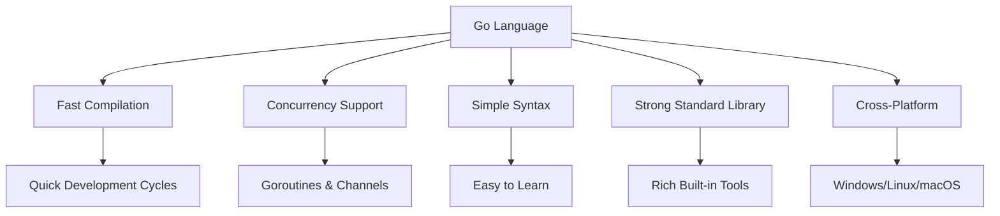
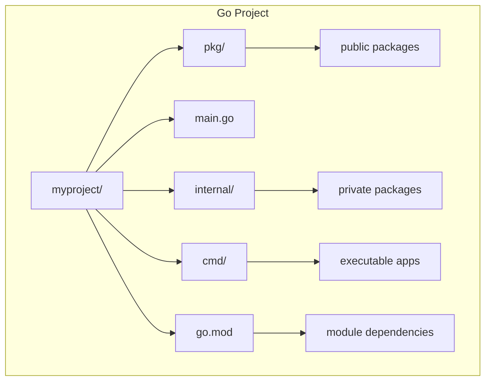
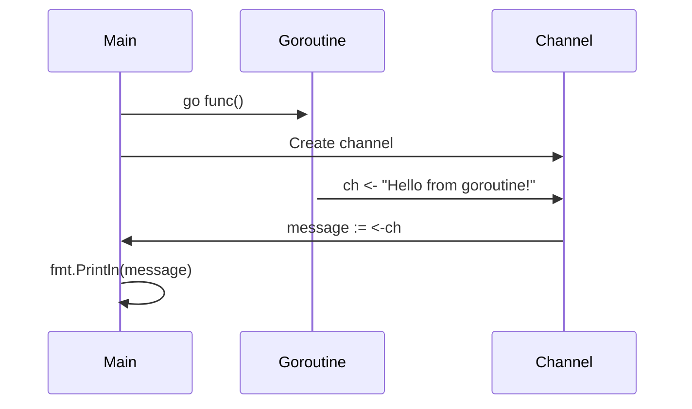

# Introduction to Go Programming

Duration: 120
Default time: 8

## Welcome to Go

Duration: 10

Go is a programming language developed by Google. It's fast, efficient, and perfect for modern software development.

---

Welcome to our presentation on Go programming. Go, also known as Golang, is a statically typed, compiled programming language designed at Google. It was created by Robert Griesemer, Rob Pike, and Ken Thompson in 2007 and was first released in 2009. Go is known for its simplicity, efficiency, and strong support for concurrent programming.

## Why Choose Go?

Duration: 12

• Fast compilation
• Built-in concurrency
• Simple syntax
• Strong standard library
• Cross-platform support



---

There are several compelling reasons to choose Go for your next project. First, Go compiles extremely quickly, which makes development cycles much faster. Second, Go has built-in support for concurrency through goroutines and channels, making it easy to write programs that can handle multiple tasks simultaneously. The syntax is clean and simple, making it easy to learn and maintain. Go also comes with a comprehensive standard library that covers most common programming tasks, and it supports cross-platform development out of the box.

## Go Syntax Basics

Duration: 8

```go
func main() {
    fmt.Println("Hello, World!")
}
```

---

Let's look at basic Go syntax. Here we have a simple Hello World program. In Go, the main function is the entry point of your program. We use the fmt package to print to the console. Notice that Go uses curly braces for code blocks and semicolons are optional at the end of statements. The language is designed to be readable and straightforward.

## Go Project Structure

Duration: 10



---

A typical Go project follows a standard structure. The go.mod file defines your module and its dependencies. The main.go file is usually the entry point. The pkg directory contains packages that can be imported by other projects, while internal contains private packages that can only be imported within your module. The cmd directory holds your application executables.

## Goroutines and Channels

Duration: 15

```go
go func() {
    ch <- "Hello from goroutine!"
}()

message := <-ch
fmt.Println(message)
```



---

One of Go's most powerful features is its concurrency model. Goroutines are lightweight threads that can run concurrently with your main program. You start a goroutine by using the 'go' keyword before a function call. Channels are used to communicate between goroutines safely. In this example, we're creating a goroutine that sends a message through a channel, and then we receive that message in the main goroutine.

## D2 Diagram Example

Duration: 10

```d2
network: {
  cell tower: {
    shape: cylinder
    style.3d: true
  }
  
  phone: {
    shape: rectangle
    style.3d: true
  }
  
  laptop: {
    shape: rectangle  
    style.3d: true
  }
  
  server: {
    shape: cylinder
    style.3d: true
  }
  
  cell tower -> phone: 4G/5G
  phone -> server: API calls
  laptop -> server: HTTPS
  server -> database: SQL
  
  database: {
    shape: cylinder
    style.3d: true
  }
}
```

---

D2 is a modern diagram scripting language that turns text to diagrams. It stands for Declarative Diagramming. Here we see a simple network architecture diagram showing how different components connect to each other. D2 makes it easy to create professional-looking diagrams with just a few lines of code.

## Thank You!

Duration: 8

Questions?

Learn more at golang.org

---

Thank you for your attention during this introduction to Go programming. I hope this presentation has given you a good overview of what makes Go special and why it's become so popular among developers. If you have any questions, please feel free to ask. To learn more about Go, I encourage you to visit the official website at golang.org, where you'll find comprehensive documentation, tutorials, and examples.